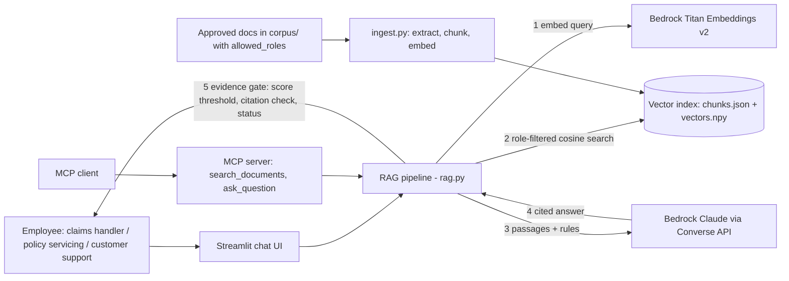

# Architecture

```mermaid
flowchart LR
  U[Employee: claims handler / policy servicing / customer support] --> UI[Streamlit chat UI]
  C[MCP client] --> MCP[MCP server: search_documents, ask_question]
  UI --> RAG[RAG pipeline - rag.py]
  MCP --> RAG
  RAG -->|1 embed query| TE[Bedrock Titan Embeddings v2]
  RAG -->|2 role-filtered cosine search| VS[(Vector index: chunks.json + vectors.npy)]
  RAG -->|3 passages + rules| CL[Bedrock Claude via Converse API]
  CL -->|4 cited answer| RAG
  RAG -->|5 evidence gate: score threshold, citation check, status| U
  D[Approved docs in corpus/ with allowed_roles] --> ING[ingest.py: extract, chunk, embed] --> VS
```
Access control: every chunk carries `allowed_roles`; filtering happens before ranking, so restricted text never reaches the LLM prompt.
